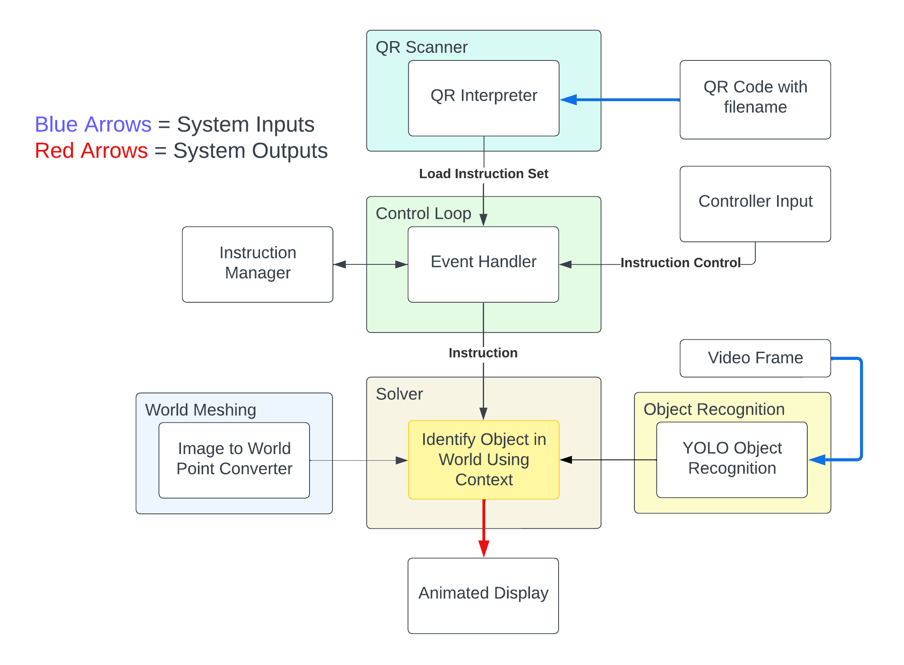

## About
I developed an augmented reality tutorial system which uses AI to locate objects in the real world and give information to the user about how to perform tasks. This was done with a small team as our senior design project and allowed a user to put on an augmented reality headset (a Magic Leap 2) and view the world with custom overlays informing them on how to complete a process. The user would simply scan a QR code which contained instructions for their task, then look at the task area in front of them and receive instructions. Our project won the Best in Track award in the Virginia Tech Senior Design Expo which is awarded to the best project in its related area.

The demo we created was a mock walk-through of adjusting the valves in a plumbing system. Our product would scan the work area and first find the valve they should be adjusting, then highlight it on their vision and provide a tooltip telling what to do with it.

  <iframe 
    src="https://youtube.com/embed/pE1Y4yRt0sE?si=cmlwHscj_2QpDQJp"
    title="YouTube video player" 
    frameborder="0" 
    allow="accelerometer; autoplay; clipboard-write; encrypted-media; gyroscope; picture-in-picture; web-share" 
    referrerpolicy="strict-origin-when-cross-origin" 
    allowfullscreen 
    style="position: absolute; top: 0; left: 0; width: 100%; height: 100%;">
  </iframe>

## Motivation
This system significantly reduces the risk of error in high severity maintenance jobs because it indicates to the user exactly what should be done and where. Workers can confidently trust that their work is correct because they are being assisted by our tool. We also provide confidence displays so that the user can make an informed decision about whether to accept the prompt given to them by our system.

## Technical
To achieve the goals described in the 'About' section, the system combines multiple complex parts which are summarized in this diagram:

### Modules
The system has various distinct modules which take various inputs from other modules or the environemnt. The inputs to the overall system were simply a QR code holding an instruction filename, user inputs for navigation, and a continous video stream of the environment seen by the user. 

#### QR Scanner
The **QR Scanner** was responsible for finding and interpreting QR codes in the world around the user. Once it found one, it would validate that the decoded information inside the code was a valid file instruction, otherwise it would keep looking. This made it more robust to random QR codes that it may pick up. Once it found a valid file name, it would output a request to the **Control Loop** to load and interate through the instructions with the user.

#### Control Loop
The **Control Loop** acts as the middleware of the system and manages communication between the user and the system. when given an instruction set filename by the **QR Scanner**, it initializes a workset and begins feeding the user instructions. It does this by passing the filename to the **Instruction Manager**, which then loads the file and waits for the **Control loop** to request new instructions before
passing them out one by one. Once a user understands and completes an instruction, they give an input through a remote controller to indicate that they are ready for the next instruction, 
at which point the **Control Loop** requests a new instruction from the **Instruction Manager**. When a user requests a new instruction, the **Control Loop** ouputs a command to the **Solver** module which handles displaying information in 3D world space to the user!

#### Solver
This module had the complex task of taking in the current context and outputting a world space display to the user. As input it took in the instuction from the **Control Loop**, the output from our **Obect Recognition** module, and the output from our **World Meshing** module. With these three core elements, it was able to produce an animated display which informed the user of their task as well as where the relevant item was. On receiving all this information, it would use the current instruction to mask out the irrelevant data from the **Object Detection** module, then pass what was left to the **World Mesher** for 2D to 3D conversion. Once it got the world space coordinates (relative to the session orign which is defined as the world location where the user started the program), it would place a world space popup that remained anchored to that spot no matter what the user's orientation became in the future.

#### Object Recognition
We trained a YOLOv5 model to recognize serveral classes of valves and connectors. YOLOv5 was perfect for us because it outputs the detected classes along with their confidences and locations in the input image (one frame from our video stream). We needed to recognize valves as they were the items to do work on, and also connectors because instructions could optionally use them to distinguish between multiple of the same type of valve based on distances from connectors and other values.

#### World Mesher
Thankfully, the Magic Leap 2 ships with a built in world meshing solution which scans the environment and builds a triangle based mesh of what it finds. We used this in our project to convert from 2D to 3D positions by first calculating a world space ray that would shoot from the camera origin through the 2D image location of interest, then test for collisions against the 3D world mesh to identify the intersection point. We were able to build the ray by using the camera's intrinsic projection parameters to build out a conversion matrix. 